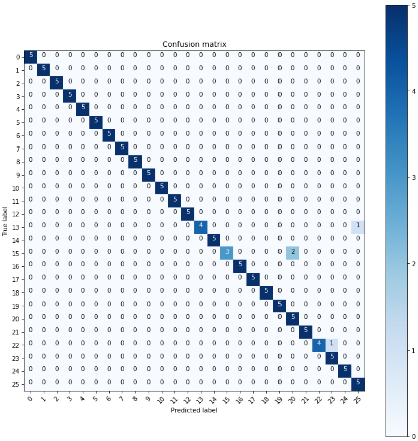

# 26 Types of Balls - Image Classification - 遷移學習練習

使用已經預訓練好的EfficientNetB3模型對26種新的球類照片做遷移學習。

## 設計與結果

模型設計

```sh
Model: "sequential"
_________________________________________________________________
Layer (type)                 Output Shape              Param #   
=================================================================
model (Functional)        (None, 1536)              10789679  
_________________________________________________________________
dense_1 (Dense)             (None, 1024)              1573888   
_________________________________________________________________
dense_2 (Dense)             (None, 512)               524800    
_________________________________________________________________
dense_3 (Dense)             (None, 256)               131328    
_________________________________________________________________
dense_4 (Dense)             (None, 26)                6682      
=================================================================
Total params: 13,026,377
Trainable params: 2,236,698
Non-trainable params: 10,789,679
_________________________________________________________________
```

測試集分數為96.9231%，混淆矩陣如下圖所示：



## 重點整理

ImageDataGenerator影像增強API，測試程式為 [image_generator.ipynb](image_generator.ipynb)  
官方中文API：https://keras.io/zh/preprocessing/image/  
參考：https://zhuanlan.zhihu.com/p/30197320

```python
train_datagen = ImageDataGenerator(rescale=1/255,
                                   rotation_range=40,
                                   shear_range=0.2,
                                   zoom_range=0.2,
                                   horizontal_flip=True,
                                   vertical_flip=True)
val_datagen = ImageDataGenerator(rescale=1/255)

train_generator = train_datagen.flow_from_directory(train_dir, batch_size=300, class_mode="categorical", target_size=(128, 128))
validation_generator = val_datagen.flow_from_directory(val_dir, batch_size=100, class_mode="categorical", target_size=(128, 128))
```

移除模型全連接層並使其權重凍結  
參考：https://blog.csdn.net/qq_29462849/article/details/83010854

```python
base_model = keras.Model(
    inputs=original_model.input,
    outputs=original_model.get_layer("batch_normalization").output,
    trainable=False
)
```

## Dataset

下載以下連結的Dataset並解壓縮至 [dataset](dataset) 目錄下

https://www.kaggle.com/datasets/gpiosenka/balls-image-classification

使用版本：Version 3
