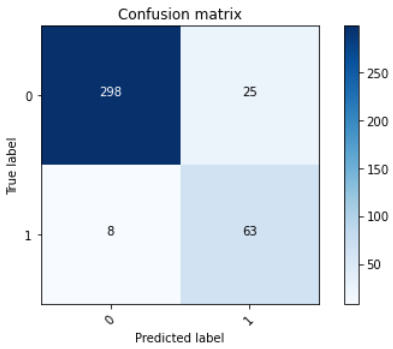
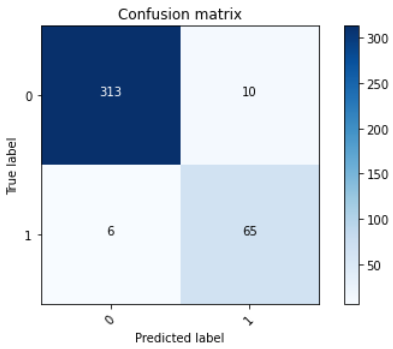
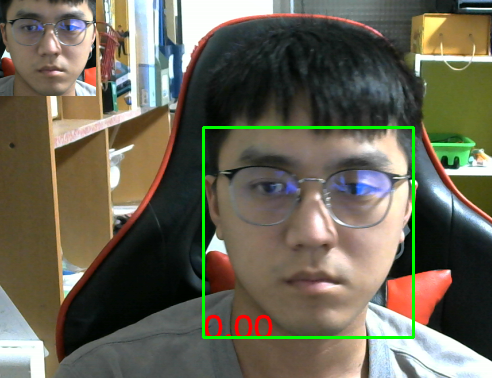

# 口罩偵測-VGG19、MobileNetV2預訓練比較

先使用[MediaPipe](https://google.github.io/mediapipe/)的[Face Detection](https://google.github.io/mediapipe/solutions/face_detection)做人臉辨識，取得人臉ROI區域並做選轉校正，再將此ROI丟到模型做口罩偵測。

## 模型結構

### MobileNetV2

模型結構：

```sh
Model: "sequential"
_________________________________________________________________
Layer (type)                 Output Shape              Param #   
=================================================================
mobilenetv2_1.00_96 (Functio (None, 1000)              3538984   
_________________________________________________________________
dense (Dense)                (None, 1)                 1001      
=================================================================
Total params: 3,539,985
Trainable params: 1,282,001
Non-trainable params: 2,257,984
_________________________________________________________________

```

訓練結果：

* ACC = 91.6244%
* 混淆矩陣


### VGG19

模型結構：

```sh
Model: "sequential"
_________________________________________________________________
Layer (type)                 Output Shape              Param #   
=================================================================
vgg19 (Functional)           (None, 3, 3, 512)         20024384  
_________________________________________________________________
flatten (Flatten)            (None, 4608)              0         
_________________________________________________________________
dense (Dense)                (None, 1000)              4609000   
_________________________________________________________________
dense_1 (Dense)              (None, 1)                 1001      
=================================================================
Total params: 24,634,385
Trainable params: 4,610,001
Non-trainable params: 20,024,384
_________________________________________________________________

```

訓練結果：

* ACC = 95.9391%
* 混淆矩陣


## 實際運作

使用VGG19預訓練模型：  


## 未解決問題

在使用MobileNetV2預訓練模型時，模型評估準確率也蠻高的，但運作在上面運作畫面的同樣測試程式上卻始終結果接近0。
