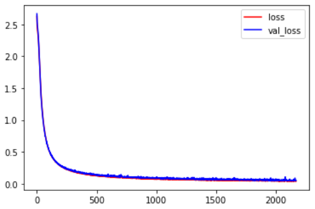
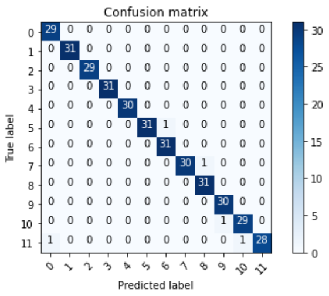

# 多元分類實作-星座分類

輸入一日期將返回此日期為何星座，星座標籤共12個，如下：  
* 摩羯座 (12/22~01/19)
* 水瓶座 (01/20~02/19)
* 雙魚座 (02/20~03/20)
* 牡羊座 (03/21~04/20)
* 金牛座 (04/21~05/20)
* 雙子座 (05/21~06/21)
* 巨蟹座 (06/22~07/22)
* 獅子座 (07/23~08/22)
* 處女座 (08/23~09/22)
* 天秤座 (09/23~10/22)
* 天蠍座 (10/23~11/21)
* 射手座 (11/22~12/21)

## 模型結構

因實做針對多元分類所以輸出層的激活函數使用softmax，且loss函數使用categorical_crossentropy([交叉熵](https://chih-sheng-huang821.medium.com/%E6%A9%9F%E5%99%A8-%E6%B7%B1%E5%BA%A6%E5%AD%B8%E7%BF%92-%E5%9F%BA%E7%A4%8E%E4%BB%8B%E7%B4%B9-%E6%90%8D%E5%A4%B1%E5%87%BD%E6%95%B8-loss-function-2dcac5ebb6cb))。


```python
Model: "sequential"
_________________________________________________________________
Layer (type)                 Output Shape              Param #   
=================================================================
input (Flatten)              (None, 1)                 0         
_________________________________________________________________
hidden_1 (Dense)             (None, 32)                64        
_________________________________________________________________
hidden_2 (Dense)             (None, 32)                1056      
_________________________________________________________________
hidden_3 (Dense)             (None, 32)                1056      
_________________________________________________________________
output (Dense)               (None, 12)                396       
=================================================================
Total params: 2,572
Trainable params: 2,572
Non-trainable params: 0
_________________________________________________________________
```

## Loss曲線



## 混淆矩陣

