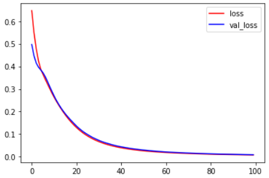
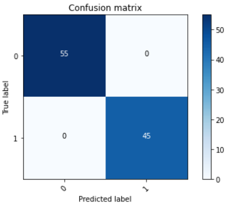

# 二元分類實作-分辨科系

透過5種科目的考試成績預測該考生為理組或文組。

## 模型結構

因實做針對二元分類所以輸出層的激活函數使用sigmoid，且loss函數使用binary_crossentropy。


```python
Model: "sequential"
_________________________________________________________________
Layer (type)                 Output Shape              Param #   
=================================================================
dense (Dense)                (None, 16)                112       
_________________________________________________________________
dense_1 (Dense)              (None, 16)                272       
_________________________________________________________________
dense_2 (Dense)              (None, 1)                 17        
=================================================================
Total params: 401
Trainable params: 401
Non-trainable params: 0
_________________________________________________________________
```

## Loss曲線



## 混淆矩陣


