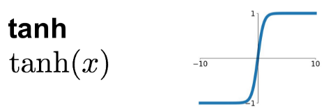

# 搭建最小的神經網路

剛開始學習的最簡單模型，計算線性解：$y=-x$

```python
Model: "sequential"
_________________________________________________________________
Layer (type)                 Output Shape              Param #   
=================================================================
dense (Dense)                (None, 1)                 1         
=================================================================
Total params: 1
Trainable params: 1
Non-trainable params: 0
_________________________________________________________________
```

## 一些激活函式的基本理解

### linear

由於是線性解，所以使用linear激活函數效果最好。


### relu

由於輸出層Dense最後會乘上relu激活函數，所以不會出現<0的數。


### tanh

由於輸出層Dense最後會乘上tanh激活函數，反而對線性解效果更糟。




