# 激活函式測試與理解

| 檔案                   | 功能                                     |
|----------------------|----------------------------------------|
| [t1.ipynb](t1.ipynb) | 使用sigmoid激活函式來訓練(-1~1)範圍內進行"乘上-1"的神經網路 |
| [t2.ipynb](t2.ipynb) | 使用relu激活函式來訓練(-1~1)範圍內進行"乘上-1"的神經網路    |
| [t3.ipynb](t3.ipynb) | 使用linear激活函式來訓練(-1~1)範圍內進行"乘上-1"的神經網路  |
| [t4.ipynb](t4.ipynb) | 使用tanh激活函式來訓練(-1~1)範圍內進行"乘上-1"的神經網路    |
| [t5.ipynb](t5.ipynb) | 使用sigmoid激活函式來訓練(0~1)範圍內進行"1的補數"的神經網路  |
| [t6.ipynb](t6.ipynb) | 使用relu激活函式來訓練(0~1)範圍內進行"1的補數"的神經網路     |
| [t7.ipynb](t7.ipynb) | 使用linear激活函式來訓練(0~1)範圍內進行"1的補數"的神經網路   |
| [t8.ipynb](t8.ipynb) | 使用tanh激活函式來訓練(0~1)範圍內進行"1的補數"的神經網路     |

## 範圍(-1~1)的各激活函式測試

|                               |    Loss曲線圖     |      實際測試       | 理解                                                  |
|:-----------------------------:|:--------------:|:---------------:|-----------------------------------------------------|
| [t1.ipynb](t1.ipynb)  sigmoid | 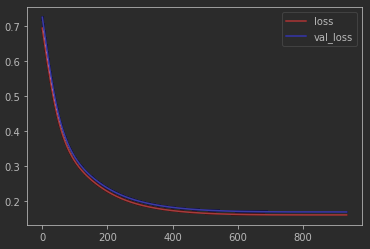 | 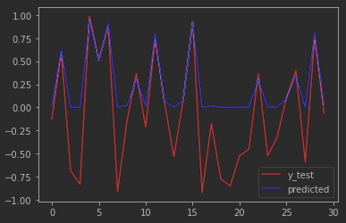  | sigmoid函式對於負數輸入的梯度變化為0。                             |
|  [t2.ipynb](t2.ipynb)  relu   | 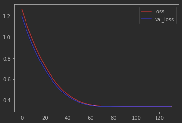 |   | 與sigmoid相同，但relu梯度變化固定都蠻大的，所以batch_size若太小會造成0學習現象。 |
| [t3.ipynb](t3.ipynb)  linear  | 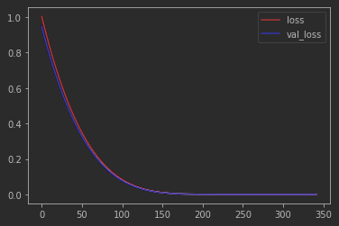 |  | 因答案就是線性解，所以linear或許為最快且最準的方法。                       |
|  [t4.ipynb](t4.ipynb)  tanh   | 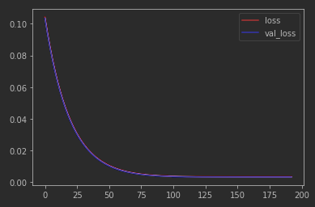 |  | 沒啥好說的，tanh變化為-1~1，適合大多場合。                           |

## 範圍[0~1)的各激活函式測試

|            範圍(0~1)            |     Loss曲線圖     |      實際測試       | 理解                               |
|:-----------------------------:|:---------------:|:---------------:|----------------------------------|
| [t5.ipynb](t5.ipynb)  sigmoid | 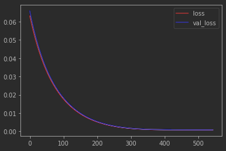 | 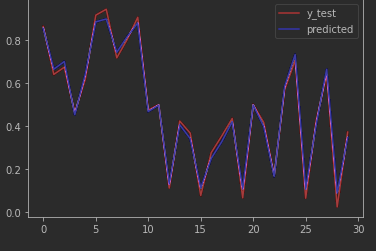 | 沒啥好說的。                           |
|  [t6.ipynb](t6.ipynb)  relu   | 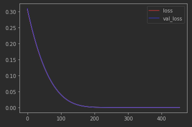 | 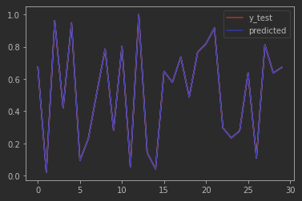 | relu在0以上幾乎與linear相同，所以也同t3的理解一樣， |
| [t7.ipynb](t7.ipynb)  linear  | 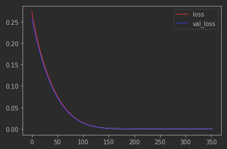 | 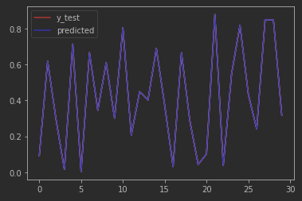 | 同上t3的理解。                         |
|  [t8.ipynb](t8.ipynb)  tanh   | 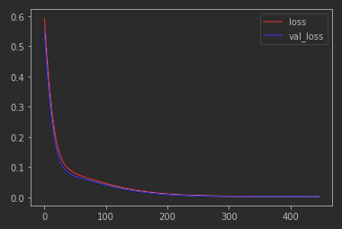 | 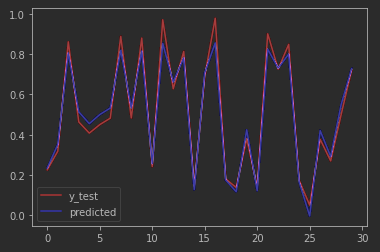 | tanh變化較sigmoid迅速。                |

